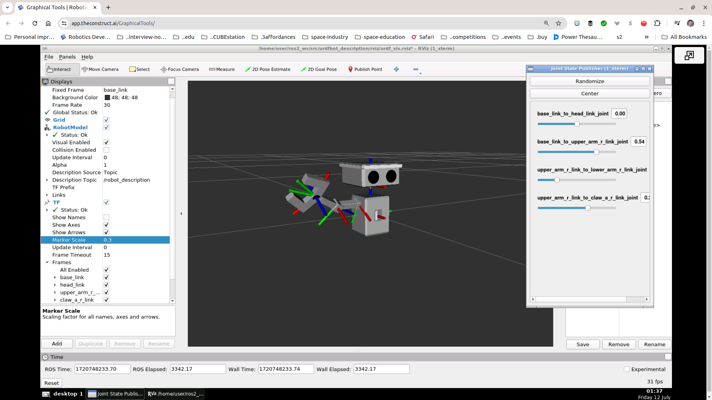

### urdfbot_description

#### Rviz2 screenshot

  

#### Calibration element illustration

The following is a conceptual representation of the `<calibration />` element in the base-head joint. See [code](https://github.com/ivogeorg/urdfbot_description/blob/d813542f0abec903213ae56cae0757b118e56bc8/urdf/urdfbot_simple.urdf#L50).  
 
```
|          switch
|        deactivated
|      ___________________             <- Falling edge (-1.5 radians)
|     /
|    /
|   /
|  /
| /_______________________             <- Joint movement direction
|                          \
|                           \
|                            \
|                             \        <- Rising edge (1.5 radians)
|                              -----------------------
|                                        switch
|                                      activated
```

